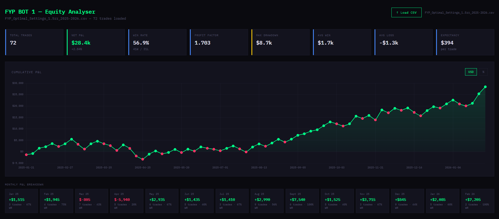
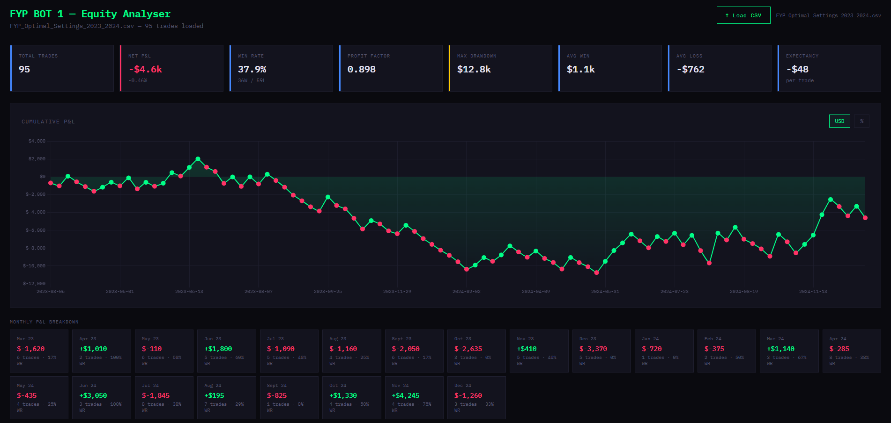

# FYP Trading Strategy

Algorithmic trading strategy research project for Maynooth University FYP 2026.

This repository documents a Pine Script strategy built in TradingView for the NASDAQ-100 E-mini futures contract (NQ1!) during the New York morning session. The strategy combines Inverse Fair Value Gaps (IFVG) and Change in State of Delivery (CISD) as a double-confirmation entry model.

> This is the original, frozen version of this research. The successor project, a more rigorous six-phase pre-registered study that disproves the edge found here, is at [fyp-strategy-engine](https://github.com/aleks-drozy/fyp-strategy-engine).

> This project is for research and education only. It is not financial advice and should not be used as a live trading recommendation.

## Backtest Results

NQ1!, January 2025 to February 2026.



| Metric | Value |
| --- | --- |
| Total trades | 72 |
| Win rate | 56.94% |
| Net P&L | +$28,400 |
| Profit factor | 1.703 |
| Max drawdown | 0.95% |
| Expectancy | +$394 per trade |

The trade log behind these figures is committed at `backtests/NQ1_optimised.csv`, and the summary image above is generated from it by `CSV_to_Equity_Graph.html`. Trade count, win rate, profit factor, net P&L and expectancy are all reproducible from that file.

## Strategy Logic

### IFVG Detection

A Fair Value Gap is a three-candle price imbalance. When price closes through the gap, the imbalance can flip into an Inverse Fair Value Gap, creating a directional signal.

- Bullish IFVG: price closes above a bearish FVG from below
- Bearish IFVG: price closes below a bullish FVG from above

### CISD Detection

Change in State of Delivery identifies a structural shift in market direction. The script tracks pullbacks, records the relevant high or low, and marks a CISD level when price breaks through that point.

- Bullish CISD: price closes above a prior bearish swing high
- Bearish CISD: price closes below a prior bullish swing low

### Trend Filter

A 20-period EMA gates every entry. The signal bar must close on the correct side of it: above the EMA for longs, below it for shorts. Length and source are inputs, defaulting to 20 periods on the close.

### Entry Model

A trade is only entered when IFVG and CISD signals align in the same direction, and both filters agree on the same bar:

- Trend: close above the 20-period EMA for longs, close below it for shorts
- Liquidity: a sweep detected on the one-minute chart and not yet expired

### Risk Management

- Stop loss: swing low for longs or swing high for shorts using an 8-bar lookback
- Take profit: 1.5R target
- Session: 09:32 to 10:00 New York time
- Frequency: maximum one trade per session

## Repository Structure

```text
FYP_Bot_1.pine                            Main Pine Script strategy
CSV_to_Equity_Graph.html                  Browser-based equity curve visualisation
backtests/NQ1_optimised.csv               In-sample trade log, 2025-26
backtests/NQ1_optimised.png               In-sample performance summary
backtests/NQ1_2023_2024                   Out-of-sample trade log, 2023-24
backtests/NQ1_2023_2024_Equity_Chart.png  Out-of-sample equity curve
README.md                                 Project documentation
```

## Optimised Parameters

| Parameter | Value |
| --- | --- |
| Session window | 09:32 to 10:00 NY |
| Risk/reward ratio | 1.5 |
| EMA length | 20 |
| Swing lookback | 8 bars |
| Sweep lookback | 5 bars |
| Sweep expiry | 5 bars |
| Max trades per day | 1 |

## Out-of-Sample Results

NQ1!, 95 trades between 6 March 2023 and 30 December 2024.

The out-of-sample period produced weaker results, which is consistent with the strategy design. The model depends on sharp, impulsive price action; low-volatility and slow-trending periods reduce the edge.



| Metric | In-sample 2025-26 | Out-of-sample 2023-24 |
| --- | --- | --- |
| Trades | 72 | 95 |
| Win rate | 56.94% | 37.89% |
| Profit factor | 1.703 | 0.898 |
| Net P&L | +$28,400 | -$4,600 |

The out-of-sample log is committed at `backtests/NQ1_2023_2024` (a TradingView CSV export saved without a file extension). Its 95 trades break down as 36 winners and 59 losers, $40,335 gross profit against $44,935 gross loss.

## How to Use

1. Open [TradingView](https://www.tradingview.com).
2. Open the Pine Script editor.
3. Copy `FYP_Bot_1.pine` into the editor.
4. Add the script to a chart.
5. Review results in the Strategy Tester tab.

To use the equity graph tool, export a TradingView strategy CSV and open `CSV_to_Equity_Graph.html` in a browser.

## Supervisor

Dr. Phil Maguire, Department of Computer Science, Maynooth University.
